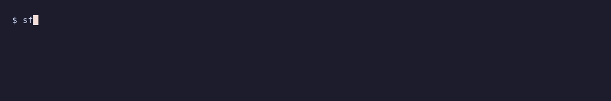

<div align="center">
    
    <br/><br/>
    <b>Salesforce CLI plugin by @tomcarman</b>
    <br/><br/>
  
  [](https://www.npmjs.com/package/sf-raven-cli) [](https://npmjs.org/package/sf-raven-cli) [](https://raw.githubusercontent.com/tomcarman/sf-raven-cli/main/LICENSE.txt)

</div>
</br>

## Overview

* [Features](#features)
* [Install](#install)
* [Command Reference](#command-reference)
  * [sf raven object display fields](#sf-raven-object-display-fields)
  * [sf raven object display recordtypes](#sf-raven-object-display-recordtypes)
  * [sf raven object display validationrules](#sf-raven-object-display-validationrules)
  * [sf raven inspect automations](#sf-raven-inspect-automations)
  * [sf raven inspect dependencies](#sf-raven-inspect-dependencies)
  * [sf raven inspect field](#sf-raven-inspect-field)
  * [sf raven pull](#sf-raven-pull)
  * [sf raven pull list](#sf-raven-pull-list)
  * [sf raven pull remote](#sf-raven-pull-remote)
  * [sf raven pull remote type add](#sf-raven-pull-remote-type-add)
  * [sf raven pull remote type list](#sf-raven-pull-remote-type-list)
  * [sf raven pull remote type remove](#sf-raven-pull-remote-type-remove)
  * [sf raven profile sync](#sf-raven-profile-sync)
  * [sf raven profile sync select](#sf-raven-profile-sync-select)
  * [sf raven deploy cancel](#sf-raven-deploy-cancel)
  * [sf raven query ids](#sf-raven-query-ids)
  * [sf raven query record](#sf-raven-query-record)
  * [sf raven audit display](#sf-raven-audit-display)
  * [sf raven event subscribe](#sf-raven-event-subscribe)
  * [sf raven apex log](#sf-raven-apex-log)

## Features

Full details, usage, examples etc are further down, or can be accessed via `--help` on the commands.


**[sf raven object display fields](#sf-raven-object-display-fields)** - _Show field information for a given sObject._  
<details><summary>Example</summary><br/></details>

- [sf raven object display recordtypes](#sf-raven-object-display-recordtypes)
  - Show RecordType information for a given sObject.
  - <details><summary>Demo</summary><br/></details>
- [sf raven object display validationrules](#sf-raven-object-display-validationrules)
  - Show Validation Rule information for a given sObject.
  - <details><summary>Demo</summary><br/></details>
- [sf raven inspect automations](#sf-raven-inspect-automations)
  - Show all automation that fires on a given sObject.
  - <details><summary>Demo</summary><br/></details>
- [sf raven inspect dependencies](#sf-raven-inspect-dependencies)
  - Show what a metadata component depends on and what depends on it.
  - <details><summary>Demo</summary><br/></details>
- [sf raven inspect field](#sf-raven-inspect-field)
  - Find everywhere a field is referenced across the org's metadata.
  - <details><summary>Demo</summary><br/></details>
- [sf raven audit display](#sf-raven-audit-display)
  - Show recent entries in the Setup Audit Trail.
  - <details><summary>Demo</summary><br/></details>
- [sf raven event subscribe](#sf-raven-event-subscribe)
  - Subscribe to Platform Events, streamed to your terminal.
  - <details><summary>Demo</summary><br/></details>
- [sf raven deploy cancel](#sf-raven-deploy-cancel)
  - Query an org for pending or in progress Salesforce deployments, and cancel them.
  - <details><summary>Demo</summary><br/></details>
- [sf raven query ids](#sf-raven-query-ids)
  - Run a SOQL query against a large list of Salesforce IDs.
  - <details><summary>Demo</summary><br/></details>
- [sf raven query record](#sf-raven-query-record)
  - Fetch any record by id with full-field output.
  - <details><summary>Demo</summary><br/></details>
- [sf raven apex log](#sf-raven-apex-log)
  - Tail Apex debug logs in real time, streamed to your terminal - a wrapper around the native `sf apex tail log` that makes it better.
  - <details><summary>Demo</summary><br/></details>
- [sf raven pull](#sf-raven-pull)
  - Update Salesforce metadata into the local project via a fuzzy finder.
  - <details><summary>Demo</summary><br/></details>
- [sf raven pull list](#sf-raven-pull-list)
  - List metadata types and components available to pull, as JSON for machine consumption.
  - <details><summary>Demo</summary><br/></details>
- [sf raven pull remote](#sf-raven-pull-remote)
  - Retrieve Salesforce metadata that exists in the org but not locally, by selecting a configured metadata type and then one or more remote components.
  - <details><summary>Demo</summary><br/></details>
- [sf raven pull remote type add](#sf-raven-pull-remote-type-add)
  - Add metadata types to the remote pull configuration.
  - <details><summary>Demo</summary><br/></details>
- [sf raven pull remote type list](#sf-raven-pull-remote-type-list)
  - List metadata types supported by remote pull.
  - <details><summary>Demo</summary><br/></details>
- [sf raven pull remote type remove](#sf-raven-pull-remote-type-remove)
  - Remove metadata types from the remote pull configuration.
  - <details><summary>Demo</summary><br/></details>
- [sf raven profile sync](#sf-raven-profile-sync)
  - Sync full Profile metadata from an org into local source files - byte-identical to a full-project retrieve, in a fraction of the time.
  - <details><summary>Demo</summary><br/></details>
- [sf raven profile sync select](#sf-raven-profile-sync-select)
  - Interactively pick org profiles to sync into local source via a fuzzy finder, including adopting profiles not yet tracked.
  - <details><summary>Demo</summary><br/></details>

## Install

### Dependencies
* [fzf](https://github.com/junegunn/fzf) is required for the [sf raven pull](#sf-raven-pull) commands and [sf raven profile sync select](#sf-raven-profile-sync-select), and should be available on your path. (IMO they are probably the most useful commands in this plugin, so its worth setting up fzf if you don't have it.)

### Quick Install

Assuming you already have the [sf cli](https://developer.salesforce.com/tools/salesforcecli) installed, the plugin can be installed by running:

`sf plugins install sf-raven-cli`

Note: You'll be prompted that this is not officially code-signed by Salesforce - like any custom plugin. You can just accept this when prompted, or alternatively you can [whitelist it](https://developer.salesforce.com/docs/atlas.en-us.sfdx_setup.meta/sfdx_setup/sfdx_setup_allowlist.htm)

> [!WARNING]
> If you previously installed the package as `sf-raven`, migrate to the renamed package with:

```sh
sf plugins uninstall sf-raven
sf plugins install sf-raven-cli
```

### Updating the plugin

The plugin can be updated to the latest version using

`sf plugins update`

### Install from source

1. Install the [SDFX CLI](https://developer.salesforce.com/docs/atlas.en-us.sfdx_setup.meta/sfdx_setup/sfdx_setup_install_cli.htm)
2. Clone the repository: `git clone git@github.com:tomcarman/sf-raven-cli.git`
3. Install npm modules: `npm install`
4. Link the plugin: `sf plugins link .`

### Compatibility

- **macOS**
  - Plugin has been built on macOS and will always run on macOS

## Command Reference

### sf raven object display fields

Show field information for a given sObject.

FieldDefinition metadata is queried for the given sObject. The field Labels, API names, and Type are displayed.

```
USAGE
  $ sf raven object display fields -o <value> -s <value> [--json] [-c <value>]

FLAGS
  -c, --csv=<value>         Path to write field information as CSV. When supplied, table output is suppressed.
  -o, --target-org=<value>  (required) Login username or alias for the target org.
  -s, --sobject=<value>     (required) The API name of the sObject that you want to view fields for. Use a comma-delimited list to query multiple objects.

GLOBAL FLAGS
  --json  Format output as json.

DESCRIPTION
  Show field information for a given sObject.

  FieldDefinition metadata is queried for the given sObject. The field Labels, API names, and Type are displayed.

EXAMPLES
  $ sf raven object display fields --target-org dev --sobject Account

  $ sf raven object display fields --target-org dev --sobject My_Custom_Object__c

  $ sf raven object display fields --target-org dev --sobject Account,Contact

  $ sf raven object display fields --target-org dev --sobject Account --csv account-fields.csv


OUTPUT

Name               Developer Name  Type
────────────────── ─────────────── ─────────────────
Account Number     AccountNumber   Text(40)
Account Source     AccountSource   Picklist
Annual Revenue     AnnualRevenue   Currency(18, 0)
...
```

### sf raven object display recordtypes

Show RecordType information for a given sObject.

RecordType metadata is queried for the given sObject. The RecordType Name, DeveloperName, and Id are displayed.

```
USAGE
  $ sf raven object display recordtypes -o <value> -s <value> [--json] [-c <value>]

FLAGS
  -c, --csv=<value>         Path to write Record Type information as CSV. When supplied, table output is suppressed.
  -o, --target-org=<value>  (required) Login username or alias for the target org.
  -s, --sobject=<value>     (required) The API name of the sObject that you want to view Record Types for. Use a comma-delimited list to query multiple objects.

GLOBAL FLAGS
  --json  Format output as json.

DESCRIPTION
  Show RecordType information for a given sObject.

  RecordType metadata is queried for the given sObject. The RecordType Name, DeveloperName, and Id are displayed.

EXAMPLES
  $ sf raven object display recordtypes --target-org dev --sobject Account

  $ sf raven object display recordtypes --target-org dev --sobject My_Custom_Object__c

  $ sf raven object display recordtypes --target-org dev --sobject Account,Opportunity

  $ sf raven object display recordtypes --target-org dev --sobject Account --csv account-record-types.csv


OUTPUT

Name                Developer Name          Id
─────────────────── ─────────────────────── ──────────────────
Business Account    Business_Account        0124J000000XXXXABC
Person Account      PersonAccount           0124J000000YYYYDEF
...
```

### sf raven object display validationrules

Show Validation Rule information for a given sObject.

Validation Rules are queried for the given sObject. The rule Name, Active status, Description, and Error Message are displayed.

```
USAGE
  $ sf raven object display validationrules -o <value> -s <value> [--json] [-c <value>] [-a]

FLAGS
  -a, --active              Only show active validation rules.
  -c, --csv=<value>         Path to write Validation Rule information as CSV. When supplied, table output is suppressed.
  -o, --target-org=<value>  (required) Login username or alias for the target org.
  -s, --sobject=<value>     (required) The API name of the sObject to view Validation Rules for. Use a comma-delimited list to query multiple objects.

GLOBAL FLAGS
  --json  Format output as json.

DESCRIPTION
  Show Validation Rule information for a given sObject.

  Validation Rules are queried for the given sObject. The rule Name, Active status, Description, and Error Message are displayed.

EXAMPLES
  $ sf raven object display validationrules --target-org dev --sobject Account

  $ sf raven object display validationrules --target-org dev --sobject My_Custom_Object__c

  $ sf raven object display validationrules --target-org dev --sobject Account,Contact

  $ sf raven object display validationrules --target-org dev --sobject Account --csv account-validation-rules.csv


OUTPUT

Name                     Active  Description                       Error Message
──────────────────────── ─────── ───────────────────────────────── ─────────────────────────────
Require_Account_Number   true    Account Number required to close  Account Number is required
Valid_Billing_Country    false   Billing country must be ISO code  Enter a valid billing country
...
```

### sf raven inspect automations

Displays Apex Triggers, record-triggered Flows, Workflow Rules, and Process Builder processes that are configured on the given sObject, grouped by execution phase.

By default only active automation is shown. Use `--all` to include inactive items.

```
USAGE
  $ sf raven inspect automations -o <value> -s <value> [--json] [-a]

FLAGS
  -a, --all                 Include inactive automation. Active items display normally, inactive items are dimmed with an Active indicator.
  -o, --target-org=<value>  (required) Login username or alias for the target org.
  -s, --sobject=<value>     (required) The API name of the sObject to inspect.

GLOBAL FLAGS
  --json  Format output as json.

DESCRIPTION
  Displays Apex Triggers, record-triggered Flows, Workflow Rules, and Process Builder processes that are configured on the given sObject, grouped by execution phase.

  By default only active automation is shown. Use --all to include inactive items.

EXAMPLES
  $ sf raven inspect automations --target-org dev --sobject Account

  $ sf raven inspect automations --target-org dev --sobject Account --all

  $ sf raven inspect automations --target-org dev --sobject Opportunity


OUTPUT

Automation on Account (3)

Phase           Type          Name                        Events          Order
─────────────── ───────────── ─────────────────────────── ─────────────── ─────
Before Save     Flow          Account Before Save         Insert, Update  1
After Trigger   Apex Trigger  AccountTrigger              Insert, Update
Post-Save       Workflow Rule Notify Account Owner        Insert, Update
```

### sf raven inspect dependencies

Queries the MetadataComponentDependency API to show outbound dependencies (what this component uses) and inbound references (what uses this component).

Supported types: ApexClass, ApexTrigger, Flow, CustomObject, CustomField, LightningComponentBundle, AuraDefinitionBundle.

For CustomField, provide the name as ObjectApiName.FieldApiName (e.g. Account.MyField__c).

```
USAGE
  $ sf raven inspect dependencies -o <value> -t <value> -n <value> [--json]

FLAGS
  -n, --name=<value>        (required) The API name of the component. For CustomField use ObjectName.FieldName format.
  -o, --target-org=<value>  (required) Login username or alias for the target org.
  -t, --type=<value>        (required) The metadata type of the component (e.g. ApexClass, Flow, CustomObject, CustomField).

GLOBAL FLAGS
  --json  Format output as json.

DESCRIPTION
  Queries the MetadataComponentDependency API to show outbound dependencies (what this component uses) and inbound references (what uses this component).

  Supported types: ApexClass, ApexTrigger, Flow, CustomObject, CustomField, LightningComponentBundle, AuraDefinitionBundle.

  For CustomField, provide the name as ObjectApiName.FieldApiName (e.g. Account.MyField__c).

EXAMPLES
  $ sf raven inspect dependencies --target-org dev --type ApexClass --name AccountService

  $ sf raven inspect dependencies --target-org dev --type Flow --name Sync_Account_to_ERP

  $ sf raven inspect dependencies --target-org dev --type CustomObject --name Account

  $ sf raven inspect dependencies --target-org dev --type CustomField --name Account.MyField__c


OUTPUT

Dependencies for ApexClass: ServicesService

Depends on (3)
Type           Name
─────────────  ─────────────────────────────────
CustomField    Service__c.Status__c
CustomObject   Service
ApexClass      DmlOps

Referenced by (2)
Type       Name
─────────  ─────────────────────────────────────────
ApexClass  ServicesServiceTest
Flow       Opportunity_Update_Create_Service_Records
```

### sf raven inspect field

Queries the MetadataComponentDependency API to find Apex classes, triggers, Flows, and other metadata that references the given custom field.

For full coverage, use `--deep`. This retrieves FlexiPages, Layouts, and Flows via the Metadata API and text-searches their source, catching declarative references the dependency API does not track (including references to standard fields). The `--deep` retrieve is slower (typically 15-60s, longer on large orgs).

Standard fields (e.g. Name, CreatedDate) can only be inspected with `--deep`, as the dependency API does not track them.

```
USAGE
  $ sf raven inspect field -o <value> -s <value> -f <value> [--json] [--deep]

FLAGS
      --deep                Retrieve FlexiPages, Layouts, and Flows and text-search them for references. Slower, but catches declarative references the dependency API misses, and works for standard fields.
  -f, --field=<value>       (required) The API name of the field to inspect.
  -o, --target-org=<value>  (required) Login username or alias for the target org.
  -s, --sobject=<value>     (required) The API name of the sObject the field belongs to.

GLOBAL FLAGS
  --json  Format output as json.

DESCRIPTION
  Queries the MetadataComponentDependency API to find Apex classes, triggers, Flows, and other metadata that references the given custom field.

  For full coverage, use --deep. This retrieves FlexiPages, Layouts, and Flows via the Metadata API and text-searches their source, catching declarative references the dependency API does not track (including references to standard fields). The --deep retrieve is slower (typically 15-60s, longer on large orgs).

  Standard fields (e.g. Name, CreatedDate) can only be inspected with --deep, as the dependency API does not track them.

EXAMPLES
  $ sf raven inspect field --target-org dev --sobject Account --field MyCustomField__c

  $ sf raven inspect field --target-org dev --sobject Account --field MyCustomField__c --deep

  $ sf raven inspect field --target-org dev --sobject Account --field AnnualRevenue --deep


OUTPUT

References to Account.MyCustomField__c (3 found)

Type       Name                 Source
─────────  ───────────────────  ──────────
ApexClass  AccountService       dependency
Flow       Sync_Account_to_ERP  dependency
Layout     Account Layout       deep
```

### sf raven pull

Refresh local Salesforce metadata from an authenticated org. Without `--all`, local metadata paths are loaded into fzf so you can choose one or more files or directories to retrieve. Press Tab to select multiple paths, then Enter to retrieve them together. With `--all`, each package directory from sfdx-project.json is retrieved.

```
USAGE
  $ sf raven pull [--json] [-o <value>] [-a]

FLAGS
  -a, --all                 Retrieve all local package directories instead of selecting a path with fzf.
  -o, --target-org=<value>  Login username or alias for the target org. Uses the default org when omitted.

GLOBAL FLAGS
  --json  Format output as json.

DESCRIPTION
  Refresh local Salesforce metadata from an authenticated org. Without --all, local metadata paths are loaded into fzf so you can choose one or more files or directories to retrieve. Press Tab to select multiple paths, then Enter to retrieve them together. With --all, each package directory from sfdx-project.json is retrieved.

EXAMPLES
  $ sf raven pull

  $ sf raven pull --target-org dev

  $ sf raven pull --all

  $ sf raven pull --target-org dev --all
```

### sf raven pull list

Report the metadata inventory used by the interactive pull commands, without any prompts. By default, lists the effective metadata types (the configured `pullRemote.metadataTypes` plugin config, or the types present in the local project when no config exists) with a count of local components per type. Use `--all-types` to list every metadata type the org supports, or `--metadata-type` to list the merged local/remote component list for a single type. Designed for machine consumption via `--json`.

```
USAGE
  $ sf raven pull list [--json] [-o <value>] [--all-types | -m <value>]

FLAGS
  -m, --metadata-type=<value>  List the merged local/remote components for this metadata type.
  -o, --target-org=<value>     Username or alias of the target org.
      --all-types              List every metadata type the org supports, instead of the effective type list.

GLOBAL FLAGS
  --json  Format output as json.

DESCRIPTION
  Report the metadata inventory used by the interactive pull commands, without any prompts. By default, lists the effective metadata types (the configured `pullRemote.metadataTypes` plugin config, or the types present in the local project when no config exists) with a count of local components per type. Use `--all-types` to list every metadata type the org supports, or `--metadata-type` to list the merged local/remote component list for a single type. Designed for machine consumption via `--json`.

EXAMPLES
  $ sf raven pull list --json

  $ sf raven pull list --all-types --json

  $ sf raven pull list --metadata-type ApexClass --json
```

### sf raven pull remote

Select a configured metadata type, then list components of that type that exist in the target org but are not present in the local project. Org-only components are prefixed with a cloud marker in fzf. Press Tab to select multiple components, then Enter to retrieve them.

```
USAGE
  $ sf raven pull remote [--json] [-o <value>]

FLAGS
  -o, --target-org=<value>  Login username or alias for the target org. Uses the default org when omitted.

GLOBAL FLAGS
  --json  Format output as json.

DESCRIPTION
  Select a configured metadata type, then list components of that type that exist in the target org but are not present in the local project. Org-only components are prefixed with a cloud marker in fzf. Press Tab to select multiple components, then Enter to retrieve them.

EXAMPLES
  $ sf raven pull remote

  $ sf raven pull remote --target-org dev
```

### sf raven pull remote type add

List metadata types available in the target org and select one or more to add to this project's `sf raven pull remote` configuration. Press Tab to select multiple types in fzf, then Enter to save them.

```
USAGE
  $ sf raven pull remote type add [--json] [-o <value>]

FLAGS
  -o, --target-org=<value>  Login username or alias for the target org. Uses the default org when omitted.

GLOBAL FLAGS
  --json  Format output as json.

DESCRIPTION
  List metadata types available in the target org and select one or more to add to this project's `sf raven pull remote` configuration. Press Tab to select multiple types in fzf, then Enter to save them.

EXAMPLES
  $ sf raven pull remote type add

  $ sf raven pull remote type add --target-org dev
```

### sf raven pull remote type list

Display the metadata types that `sf raven pull remote` can inspect. If no project configuration has been saved yet, the list is derived from metadata types already present in the local project.

```
USAGE
  $ sf raven pull remote type list [--json]

GLOBAL FLAGS
  --json  Format output as json.

DESCRIPTION
  Display the metadata types that `sf raven pull remote` can inspect. If no project configuration has been saved yet, the list is derived from metadata types already present in the local project.

EXAMPLES
  $ sf raven pull remote type list
```

### sf raven pull remote type remove

Select one or more metadata types to remove from this project's `sf raven pull remote` configuration. Press Tab to select multiple types in fzf, then Enter to save the updated list.

```
USAGE
  $ sf raven pull remote type remove [--json]

GLOBAL FLAGS
  --json  Format output as json.

DESCRIPTION
  Select one or more metadata types to remove from this project's `sf raven pull remote` configuration. Press Tab to select multiple types in fzf, then Enter to save the updated list.

EXAMPLES
  $ sf raven pull remote type remove
```

### sf raven profile sync

Reads the complete content of each Profile directly from the org via the CRUD Metadata API, which is not package-context-scoped, filters it down to the components tracked in local source, and overwrites the tracked profile files in place, wherever they live across package directories. The output is byte-identical to what a full-project `sf project retrieve` would produce for the profiles, in a fraction of the time. With no arguments, every profile tracked in local source is synced; profiles are fetched in parallel batches, and profiles that exist locally but not in the org are skipped with a warning. Entries that reference metadata not present in the local project are filtered out; user permissions, login IP ranges, the custom flag, and the user license are always kept in full. The org read uses the project's sourceApiVersion.

Each synced profile is reported with a per-section summary of entries added, removed, and modified. With `--dry-run`, no files are written: the command prints the changes a sync would make and exits non-zero if any profile differs from the org (or could not be read from it), so CI can detect profiles changed directly in the org.

```
USAGE
  $ sf raven profile sync -o <value> [--json] [-p <value>...] [--dry-run]

FLAGS
  -o, --target-org=<value>  (required) Username or alias of the target org.
  -p, --profile=<value>...  Comma-separated names of the profiles to sync. Defaults to every profile tracked in local source.
      --dry-run             Report what a sync would change without writing any files, and exit non-zero if any profile differs from the org or could not be checked.

GLOBAL FLAGS
  --json  Format output as json.

DESCRIPTION
  Reads the complete content of each Profile directly from the org via the CRUD Metadata API, which is not package-context-scoped, filters it down to the components tracked in local source, and overwrites the tracked profile files in place, wherever they live across package directories. The output is byte-identical to what a full-project `sf project retrieve` would produce for the profiles, in a fraction of the time. With no arguments, every profile tracked in local source is synced; profiles are fetched in parallel batches, and profiles that exist locally but not in the org are skipped with a warning. Entries that reference metadata not present in the local project are filtered out; user permissions, login IP ranges, the custom flag, and the user license are always kept in full. The org read uses the project's sourceApiVersion.

  Each synced profile is reported with a per-section summary of entries added, removed, and modified. With --dry-run, no files are written: the command prints the changes a sync would make and exits non-zero if any profile differs from the org (or could not be read from it), so CI can detect profiles changed directly in the org.

EXAMPLES
  $ sf raven profile sync

  $ sf raven profile sync --profile "Admin,Standard User"

  $ sf raven profile sync --profile Admin --target-org my-org

  $ sf raven profile sync --dry-run


OUTPUT

Synced Admin -> force-app/main/default/profiles/Admin.profile-meta.xml
    fieldPermissions: 2 added, 1 modified
    userPermissions: 1 modified
Standard User is already up to date.
```

### sf raven profile sync select

Lists every profile in the target org, alongside every profile tracked in local source, in a multi-select fuzzy picker (requires fzf). Each profile is annotated with its status: "both" (tracked locally and in the org), "remote" (org only), or "local" (local source only). Selected profiles that are tracked locally are refreshed in place through the same pipeline as `sf raven profile sync`. Selected profiles that exist only in the org are adopted: a new profile file is created in the default package directory's profiles folder, filtered to the components tracked in local source and serialized identically to synced profiles. Selected local-only profiles are skipped with a warning, and cancelling the picker makes no changes.

```
USAGE
  $ sf raven profile sync select -o <value> [--json]

FLAGS
  -o, --target-org=<value>  (required) Username or alias of the target org.

GLOBAL FLAGS
  --json  Format output as json.

DESCRIPTION
  Lists every profile in the target org, alongside every profile tracked in local source, in a multi-select fuzzy picker (requires fzf). Each profile is annotated with its status: "both" (tracked locally and in the org), "remote" (org only), or "local" (local source only). Selected profiles that are tracked locally are refreshed in place through the same pipeline as "sf raven profile sync". Selected profiles that exist only in the org are adopted: a new profile file is created in the default package directory's profiles folder, filtered to the components tracked in local source and serialized identically to synced profiles. Selected local-only profiles are skipped with a warning, and cancelling the picker makes no changes.

EXAMPLES
  $ sf raven profile sync select

  $ sf raven profile sync select --target-org my-org


OUTPUT

Synced Admin -> force-app/main/default/profiles/Admin.profile-meta.xml
    classAccesses: 1 added
Created Read Only -> force-app/main/default/profiles/Read Only.profile-meta.xml
    fieldPermissions: 42 added
    userPermissions: 18 added
```

### sf raven deploy cancel

Query the target org for pending or in-progress deploy requests, select one from an interactive list, confirm the cancellation, and submit an asynchronous deploy cancel request.

```
USAGE
  $ sf raven deploy cancel [--json] [-o <value>]

FLAGS
  -o, --target-org=<value>  Login username or alias for the target org. Uses the default org when omitted.

GLOBAL FLAGS
  --json  Format output as json.

DESCRIPTION
  Query the target org for pending or in-progress deploy requests, select one from an interactive list, confirm the cancellation, and submit an asynchronous deploy cancel request.

EXAMPLES
  $ sf raven deploy cancel

  $ sf raven deploy cancel --target-org dev
```

### sf raven query ids

Read Salesforce IDs from a file, deduplicate and validate them, split them into safe query batches, and run a SOQL query with the IDs inserted at the `{ids}` placeholder.

```
USAGE
  $ sf raven query ids -f <value> -q <value> [--json] [-o <value>] [-b <value>] [-c <value>] [-l <value>]

FLAGS
  -b, --batch-size=<value>  Number of IDs to include in each query batch. By default, batches are sized to fit Salesforce URI limits.
  -c, --csv=<value>         Path to write query results as CSV. When supplied, table output is suppressed.
  -f, --file=<value>        (required) Path to a file containing one Salesforce ID per row.
  -l, --limit=<value>       Process only the first N unique valid IDs from the file.
  -o, --target-org=<value>  Login username or alias for the target org. Uses the default org when omitted.
  -q, --query=<value>       (required) SOQL query to run. Must include the {ids} placeholder where the ID list should be inserted.

GLOBAL FLAGS
  --json  Format output as json.

DESCRIPTION
  Read Salesforce IDs from a file, deduplicate and validate them, split them into safe query batches, and run a SOQL query with the IDs inserted at the {ids} placeholder.

EXAMPLES
  $ sf raven query ids --file account-ids.txt --query "SELECT Id, Name FROM Account WHERE Id IN {ids}"

  $ sf raven query ids --file account-ids.txt --query "SELECT Id, Name FROM Opportunity WHERE AccountId IN {ids}"

  $ sf raven query ids --file account-ids.txt --query "SELECT Id, Name FROM Account WHERE Id IN {ids}" --limit 25

  $ sf raven query ids --file account-ids.txt --query "SELECT Id, Name FROM Account WHERE Id IN {ids}" --csv results.csv
```

### sf raven query record

Detect the object from the record id's key prefix, describe the object to build the full field list, query every field, and render the record transposed for the terminal: fields as rows, one column per record. If the key prefix is unknown to the regular API, detection falls back to the Tooling API, so setup entities (e.g. ApexClass) work the same way. Long values are truncated with an ellipsis; null values render as blank cells.

```
USAGE
  $ sf raven query record -o <value> -i <value> [--json] [-f <value> | -e <value>] [-F table|json|csv|toon] [-t <value>] [--omit-null]

FLAGS
  -F, --format=<option>       [default: table] Output format: table (transposed, for the terminal), json (raw records array), csv (one row per record), or toon (TOON-encoded records array). Non-table formats never truncate values. <options: table|json|csv|toon>
  -e, --extra-fields=<value>  Comma-delimited list of fields (typically relationship paths) to add on top of the full field list.
  -f, --fields=<value>        Comma-delimited list of fields to retrieve instead of the full field list; dot-notation relationship paths (e.g. Owner.Name) are allowed.
  -i, --record-ids=<value>    (required) Comma-delimited list of 15 or 18 character record ids to fetch.
  -o, --target-org=<value>    (required) Login username or alias for the target org.
  -t, --truncate=<value>      [default: 80] Width at which table cell values are truncated with an ellipsis; 0 means unlimited. Table output only.
      --omit-null             Omit table rows where every record's value is null. Table output only.

GLOBAL FLAGS
  --json  Format output as json.

DESCRIPTION
  Detect the object from the record id's key prefix, describe the object to build the full field list, query every field, and render the record transposed for the terminal: fields as rows, one column per record. If the key prefix is unknown to the regular API, detection falls back to the Tooling API, so setup entities (e.g. ApexClass) work the same way. Long values are truncated with an ellipsis; null values render as blank cells.

EXAMPLES
  $ sf raven query record --record-ids 001Kf00001aBcDeFGH

  $ sf raven query record --record-ids 001Kf00001aBcDeFGH,001Kf00001aBcDeXYZ

  $ sf raven query record --record-ids 001Kf00001aBcDeFGH --fields Name,Industry,Owner.Name

  $ sf raven query record --record-ids 001Kf00001aBcDeFGH --extra-fields Owner.Name,Owner.Profile.Name

  $ sf raven query record --record-ids 001Kf00001aBcDeFGH --omit-null --truncate 0

  $ sf raven query record --record-ids 001Kf00001aBcDeFGH --format csv

  $ sf raven query record --record-ids 001Kf00001aBcDeFGH --format toon

  $ sf raven query record --record-ids 001Kf00001aBcDeFGH --json
```

### sf raven audit display

Show recent entries in the Setup Audit Trail.

Returns the 20 most recent Setup Audit Trail entries, but this can be increased up to 2000 using the optional `--limit` flag. The results can be filtered by a particular user using the `--username` flag.

```
USAGE
  $ sf raven audit display -o <value> [--json] [-u <value>] [-l <value>]

FLAGS
  -l, --limit=<value>       [default: 20] The number of audit trail entries to return. Maximum is 2000.
  -o, --target-org=<value>  (required) Login username or alias for the target org.
  -u, --username=<value>    Username to filter the audit trail by.

GLOBAL FLAGS
  --json  Format output as json.

DESCRIPTION
  Show recent entries in the Setup Audit Trail.

  Returns the 20 most recent Setup Audit Trail entries, but this can be increased up to 2000 using the optional --limit flag. The results can be filtered by a particular user using the --username flag.

EXAMPLES
  $ sf raven audit display --target-org dev

  $ sf raven audit display --target-org dev --limit 200

  $ sf raven audit display --target-org dev --username username@salesforce.com.dev

  $ sf raven audit display --target-org dev --limit 50 --username username@salesforce.com.dev


OUTPUT

Date                Username      Type         Action                                                      Delegate User
─────────────────── ───────────── ──────────── ─────────────────────────────────────────────────────────── ────────────────────
2023-09-29 17:23:47 user@dev.com  Apex Trigger Changed Account Created Trigger code: AccountTrigger        null
2023-09-29 17:23:43 user@dev.com  Apex Trigger Created Account Created Trigger code: AccountCreatedTrigger null
...
```

### sf raven event subscribe

Subscribe to Platform Events.

Platform Events are printed to the terminal. An optional flag can be used to replay events from a given replay id. Default timeout is 3 minutes, but can be extended to 30 minutes.

```
USAGE
  $ sf raven event subscribe -o <value> -e <value> [--json] [-r <value>] [-t <value>]

FLAGS
  -e, --event=<value>       (required) The name of the Platform Event that you want to subscribe with '/event/' prefix eg. /event/My_Event__e.
  -o, --target-org=<value>  (required) Login username or alias for the target org.
  -r, --replayid=<value>    The replay id to replay events from eg. 21980378.
  -t, --timeout=<value>     [default: 3] How long to subscribe for before timing out in minutes eg. 10. Default is 3 minutes.

GLOBAL FLAGS
  --json  Format output as json.

DESCRIPTION
  Subscribe to Platform Events.

  Platform Events are printed to the terminal. An optional flag can be used to replay events from a given replay id. Default timeout is 3 minutes, but can be extended to 30 minutes.

EXAMPLES
  $ sf raven event subscribe --target-org dev --event /event/My_Event__e

  $ sf raven event subscribe --target-org dev --event /event/My_Event__e --replayid 21980378

  $ sf raven event subscribe --target-org dev --event /event/My_Event__e --timeout 10

  $ sf raven event subscribe --target-org dev --event /event/My_Event__e --replayid 21980378 --timeout 10


OUTPUT

❯ 🔌 Connecting to org... done
❯ 📡 Listening for events...

{
  "schema": "XdDXhymeO5NOxuhzFpgDJA",
  "payload": {
    "Some_Event_Field__c": "Hello World",
    "CreatedDate": "2021-03-15T19:16:54.929Z",
  },
  "event": {
    "replayId": 21980379
  }
}
```

### sf raven apex log

Tail Apex debug logs in real time, streamed to your terminal - a wrapper around the native `sf apex tail log` that makes it better.
* Automatically manages trace flags for your user, or another user passed in (via `--user`)
* By default strips the logs to only include USER_DEBUG and errors/exceptions (or full logs can be shown with `--raw` flag)
* Logs are formatted to be more clean / readable
* Ability to filter logs by an arbitrary value
  * If you wanted to show only debug logs for a process you are actively debugging e.g. `System.debug('MyThing Account.Status: ' account.Status)`
  * Then filter the logs with `--filter MyThing` 

```
USAGE
  $ sf raven apex log [--json] [-o <value>] [-u <value>] [-f <value>] [--raw] [--no-trace] [-t <value>]

FLAGS
  -f, --filter=<value>      Only show USER_DEBUG lines containing this string. Errors and exceptions are always shown.
  -o, --target-org=<value>  Login username or alias for the target org. Uses the default org when omitted.
  -t, --timeout=<value>     [default: 3] Minutes to listen before exiting (1-30).
  -u, --user=<value>        Username to tail logs for. Defaults to the current authenticated user.
      --no-trace            Skip trace flag check. Use when managing trace flags externally.
      --raw                 Print the full log body instead of filtering to USER_DEBUG and exception lines.

GLOBAL FLAGS
  --json  Format output as json.

DESCRIPTION
  Stream Apex debug logs as they are written. Logs are filtered to show USER_DEBUG statements and exceptions by
  default. Use --raw to see the full log body.

  If no active trace flag exists for the target user, you will be prompted to create one. Without an active trace
  flag, no logs will be captured.

EXAMPLES
  $ sf raven apex log

  $ sf raven apex log --target-org dev

  $ sf raven apex log --target-org dev --user admin@myorg.com

  $ sf raven apex log --target-org dev --filter MyDebugPrefix

  $ sf raven apex log --target-org dev --raw


OUTPUT

Trace flag active until 09:32:17.
Tailing logs for tom.carman@myorg.com. Press Ctrl+C to stop.

── executeAnonymous  09:31:58  245ms ──
  [1]   DEBUG    Hello world
  [3]   DEBUG    account = Account:{Name=Acme, ...}

── UserTrigger  09:32:04  18ms ──
  [12]  DEBUG    entering trigger
  ⚠  [47]  System.NullPointerException: Attempt to de-reference a null object
```
